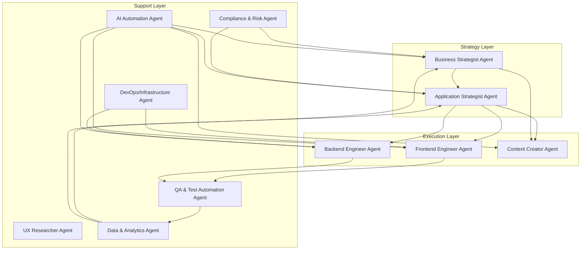

# Multi-Agent Ecosystem

```mermaid
graph TD
    subgraph Strategy Layer
        B[Business Strategist Agent]
        A[Application Strategist Agent]
    end

    subgraph Execution Layer
        FE[Frontend Engineer Agent]
        BE[Backend Engineer Agent]
        CC[Content Creator Agent]
    end

    subgraph Support Layer
        UX[UX Researcher Agent]
        DO[DevOps/Infrastructure Agent]
        QA[QA & Test Automation Agent]
        DA[Data & Analytics Agent]
        CR[Compliance & Risk Agent]
        AI[AI Automation Agent]
    end

    B --> A
    A --> FE
    A --> BE
    A --> CC
    B --> CC
    FE --> QA
    BE --> QA
    QA --> DA
    DA --> B
    DA --> A
    DO --> BE
    DO --> FE
    CR --> B
    CR --> A
    AI --> B
    AI --> A
    AI --> FE
    AI --> BE
    AI --> CC
```
